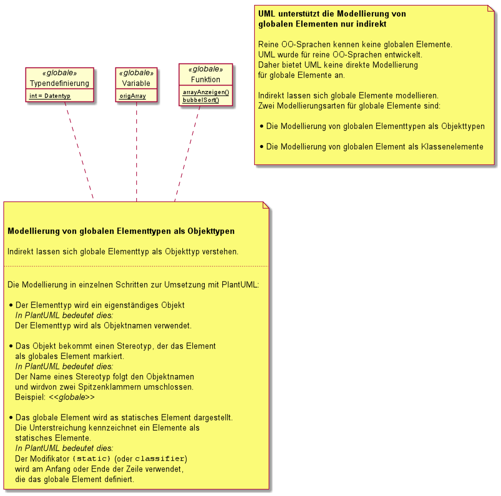

.Hinweis zur Aufgabe 1 c) des Übungsblattes _Sortieralgorithmen_
****

Das Rüstzeug::
Das Rüstzeug: Code für ein Qt-Project :::
todo

****

.Die (fehlerhaften) Code-Bruchstücke für ein Qt-Applikation _Sortieralgorithmen_
[source, cpp, linenums]
----
include::exercise-sheet--given-source-code.cpp[tags=**]
----
.Allgemeines Vorwissen
****

.{cpp} erlaubt die Benutzung von globalen Funktionen.
[NOTE]
====
{cpp} ist keine rein objektorientierte Sprache.
Hingegen ist Java eine rein objektorientierte Sprache,
in der weder globale Methoden noch globale
Variablen existieren.

====

.Java ist eine Sprache, in der weder globale Methoden noch globale Variablen existieren.
[NOTE]
=====
Siehe dazu auch:

* Java lernen in abgeschlossenen Lerneinheiten.
_Springer Verlag_
+
Das Kapitel 11 _Wie erstelle ich objektorientierte Programme_
enthält im Abschnitt _Statische Elemente_ auf der Seite 148.
Statische Elemente einer Klasse.

Die statischen Elemente einer Klasse,
also Klassenvariablen und Klassenmethoden,
übernehmen in Java die Aufgaben von globalen Elementen.
=====

****

.Die Erkenntnisse beim ersten Code lesen
****
Unser Beispielquellcode, den wir oben zeigen,
enthält eine globale Variablendeklaration,
zwei globale Funktionen und eine Funktion,
die zum Namensraum `FrmMain` gehört.

.Die globale Deklaration der Variablen.
[source, cpp]
----
include::exercise-sheet--given-source-code.cpp[tags=declare-origArray]
----

.Die globale Funktion `arrayAnzeigen`
[source, cpp]
----
void arrayAnzeigen(datentyp *array,int anz, QListWidget* lwAnzeige)
----

und

.Die globale Funktion `bubbleSort`
[source, cpp]
----
void bubbleSort(datentyp *feld, int anz)
----
Außer diesen globalen Elementen enthält der Code die Funktion
`FrmMain::on_btnBubbleSort_clicked()`.
****

.Das Modellieren von globalen ELementen in UML
****
UML unterstützt die Modellierung von  globalen Elementen nur indirekt.

Reine OO-Sprachen kennen keine globalen Elemente.
UML wurde für reine OO-Sprachen entwickelt.
Daher bietet UML keine direkte Modellierung
für globale Elemente an.

Indirekt lassen sich globale Elemente modellieren.
Zwei Modellierungsarten für globale Elemente sind:

* Die Modellierung von globalen Elementtypen in UML als Objekttypen

* Die Modellierung globaler Elemente in UML als Klassenelemente

****

.Die Modellierung von globalen Elementtypen in UML als Objekttypen
****
.Die Modellierung von globalen Elementtypen in UML als Objekttypen

****

.Die Modellierung globaler Elemente in UML als Klassenelemente
****
.Die Modellierung der globalen Elementen in UML als Klassenelemente
image::skills/uml/generated/UML__Denote_global_elements_as_static_class_members.png[]
****

.`FrmMain::on_btnBubbleSort_clicked()`: Funktion eines Namensraum oder Instanzmethode einer Klasse?
****
Es gibt zwei Interpretationsmöglichkeiten für diese Funktion.

. Sie gehört zum Namensraum (_engl._ namespace) `FrmMain`
+
In diesen Fall wäre diese eine Funktion,
die gekapselt wird durch den Namensraum `FrmMain`.
+

. Sie gehört zur Klasse `FrmMain` und
 ist eine Instanzmethode der Klasse
+
Der verwendete Stilguide erfordert:
+
[source, cpp]
----
class FrmMain : public QMainWindow
----
+
Mit anderen Worten: Die Klasse `FrmMain` leitet sich vin der Klasse `QMainWindow` ab;
repräsentiert als das Hauptfenster der Anwendung.
+
Somit gilt:
+
.Die Methode `on_btnBubbleSort_clicked()` gehört zur Klasse `FrmMain`.
[source, cpp]
----
void FrmMain::on_btnBubbleSort_clicked()
----

+
.Methoden sind Funktion, die zu einer Klasse gehören.
[NOTE]
====
Eine Funktion, die zu einer Klasse gehört, wird
als _Methode_ bezeichnet.

Es wird unterschieden zwischen
_Klassenmethoden_ und _Instanzmethoden_.

* Bestimme, ob es sich bei `FrmMain::on_btnBubbleSort_clicked()`
um eine Instanz- oder eine Klassenmethode handelt.

* Erläutere den Unterschied zwischen
einer Instanz- oder einer Klassenmethode.
====
****

.Der Namespace
****

Globale Elemente sind im implizit vorhandenden globalen Namespace
deklariert. {cpp} erlaubt neben den globalen Namespace weitere Namensräume zu definieren
Namensräume verhindern Namenskollisionen, die in größeren Projekt leicht entstehen.
{cpp} selbst benutzt den Namensraum `std::` für die Elemente,
die von der {cpp}-Standard Library benutzt werden.

.Deklaration im globalen Namespace sind möglichst zu vermeiden.
[quote, 'Erläuterung zun Namespace von {cpp} auf link:https://docs.microsoft.com/de-de/cpp/cpp/namespaces-cpp[ doc.microsoft.com]']
____
Wenn ein Bezeichner nicht in einem expliziten Namespace deklariert ist,
ist er Teil des impliziten globalen Namespaces.
Vermeiden Sie im Allgemeinen, wenn möglich,
Deklarationen im globalen Gültigkeitsbereich zu verwenden,
mit Ausnahme der Einstiegspunkt- Hauptfunktion, die sich
im globalen Namespace befinden muss.
Um einen globalen Bezeichner explizit zu qualifizieren,
verwenden Sie den Bereichsauflösungsoperator ohne Namen,
wie in `::SomeFunction(x);`.
Dadurch wird der Bezeichner von allen anderen Elementen
gleichen Namens in allen anderen Namespaces unterschieden,
und es vereinfacht außerdem das Verständnis Ihres Codes
für andere.
____

Weil {cpp} die Deklarattion von Namespaces ermöglicht,
gibt es in {cpp} nicht nur globale Element, sondern
auch sogenannte allein-stehenden Elemente
(_engl._ standalone elements) in Namensräumen.

Vor diesen Hintergrund müssen wir unsere Aussage
"`Reine OO-Sprachen kennen keine globalen Elemente`"
präziser fassen:
_Reine OO-Sprachen kennen keine stand-alone Elemente._
Denn in einer reinen OO-Sprache werden alle Elemente
durch Klassen gekapselt.

Wir passen unser Diagramm dieser Erkenntnis an.

UML unterstützt die Modellierung von globalen Elementen nur indirekt.
****

